# ⚡ Neutron AI Agent

An AI agent that earns, spends, and manages Bitcoin over the Lightning Network. Built with [Claude](https://anthropic.com) and the [Neutron SDK](https://www.npmjs.com/package/neutron-sdk).

This is a **starter template** — clone it, customize it, and build your own Bitcoin-powered AI.

```
npm install && cp .env.example .env && npm run dev
```

---

## How It Works

```mermaid
sequenceDiagram
    participant User
    participant Agent as AI Agent (Claude)
    participant Neutron as Neutron SDK
    participant LN as Lightning Network
    participant WH as Webhook Server

    User->>Agent: "Write me a poem (100 sats)"
    Agent->>Neutron: createInvoice(100 sats)
    Neutron->>LN: Generate BOLT11 invoice
    Neutron-->>Agent: invoice + txnId
    Agent-->>User: "Pay this invoice: lnbc1u..."
    User->>LN: Pays invoice ⚡
    LN->>WH: Payment notification
    WH->>Agent: onPaymentReceived(txnId)
    Agent-->>User: "Payment received! Here's your poem..."
```



The agent runs two services:
1. **Chat loop** — interactive CLI where users talk to Claude, which has tools to create invoices, send payments, and check balances
2. **Webhook server** — Express server that listens for payment notifications from the Lightning Network and notifies the agent

---

## Quick Start

### 1. Get your API keys

- **Neutron**: Sign up at [portal.neutron.me](https://portal.neutron.me) → create API key
- **Anthropic**: Get a key at [console.anthropic.com](https://console.anthropic.com)

### 2. Clone and configure

```bash
git clone https://github.com/Neutronpay/neutron-ai-agent.git
cd neutron-ai-agent
npm install
cp .env.example .env
```

Edit `.env` with your keys:

```
NEUTRON_API_KEY=your-key
NEUTRON_API_SECRET=your-secret
ANTHROPIC_API_KEY=sk-ant-...
WEBHOOK_SECRET=pick-something-random
```

### 3. Run

```bash
npm run dev
```

You'll see:

```
🔔 Webhook server listening on port 3000

⚡ Neutron AI Agent ready!
   Type a message to chat. Ctrl+C to exit.

You: _
```

---

## Example Conversation

```
You: Hey! Can you write me a haiku about Bitcoin?

Agent: I'd love to! My creative writing costs 100 sats.
       Let me generate an invoice for you...

       ⚡ Lightning Invoice:
       lnbc1u1pjk...

       Pay this and I'll get to work!

You: [pays invoice via wallet]

Agent: 💰 Payment received! Here's your haiku:

       Digital gold flows free
       Lightning strikes across the world
       Sats stack silently

You: Nice! What's my balance looking like?

Agent: Let me check...
       BTC: 0.00150000 (150,000 sats)
       USDT: 25.00

You: Send 500 sats to alice@getalby.com

Agent: Done! Sent 500 sats to alice@getalby.com.
       Transaction ID: txn_abc123
```

---

## Agent Tools

The agent has six tools it can call:

| Tool | Description |
|------|-------------|
| `check_balance` | Get wallet balances across all currencies |
| `create_invoice` | Create a Lightning invoice (amount + memo) |
| `send_payment` | Send sats to a Lightning address |
| `check_payment` | Check status of a specific transaction |
| `list_transactions` | Recent transaction history |
| `get_exchange_rate` | Current BTC/USD exchange rates |

---

## Use Cases

### 💸 Pay-per-task
Charge users before performing work. The agent quotes a price, generates an invoice, and delivers only after payment confirms.

### 🤖 Agent-to-agent payments
Connect multiple agents — one agent pays another for sub-tasks over Lightning. Instant, programmable, no bank required.

### 📡 Micropayments
Charge fractions of a cent per API call, per word, or per image. Lightning makes sub-dollar payments practical.

### 🎨 Creative marketplace
An AI that sells poems, code, images, or analysis — each with its own price. A fully autonomous digital worker.

---

## Project Structure

```
src/
├── index.ts      # Entry point — starts agent + webhook server
├── agent.ts      # Claude AI loop with tool calling
├── tools.ts      # Tool implementations using neutron-sdk
└── webhook.ts    # Express server for payment notifications
```

That's the entire codebase. ~200 lines of meaningful code.

---

## Customizing

### Change the agent's personality
Edit the `SYSTEM_PROMPT` in `src/agent.ts`. Tell it what to charge, how to behave, what tasks to accept.

### Add new tools
1. Add a tool definition to `toolDefinitions` in `src/tools.ts`
2. Add the implementation in the `executeTool` switch statement
3. The agent will automatically discover and use it

### Change the pricing
Set `TASK_PRICE_SATS` in `.env`, or modify the system prompt to use dynamic pricing.

### Use a different model
Set `CLAUDE_MODEL` in `.env` (e.g. `claude-sonnet-4-20250514`, `claude-opus-4-20250514`).

### Deploy the webhook
In production, expose the webhook endpoint publicly (e.g. via ngrok, Cloudflare Tunnel, or your server). Then register it with Neutron:

```typescript
import { Neutron } from "neutron-sdk";

const neutron = new Neutron({ apiKey: "...", apiSecret: "..." });
await neutron.webhooks.create({
  callback: "https://your-domain.com/webhooks/neutron",
  secret: "your-webhook-secret",
});
```

---

## Tech Stack

- **[Neutron SDK](https://www.npmjs.com/package/neutron-sdk)** — Bitcoin Lightning payments
- **[Anthropic Claude](https://anthropic.com)** — AI with tool calling
- **Express** — Webhook listener
- **TypeScript** — Type safety throughout

## License

MIT
